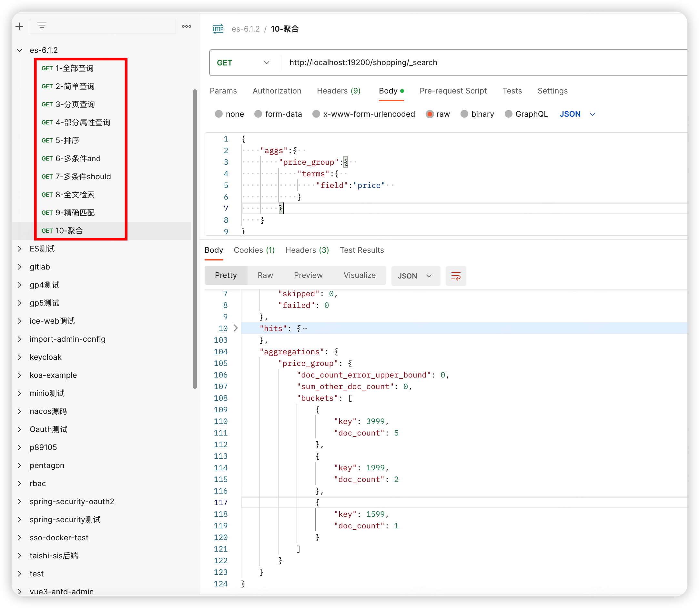
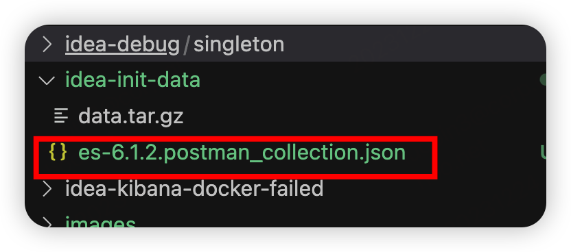

## 初始化数据

```
curl -XPUT http://localhost:19200/shopping
curl -XPOST http://localhost:19200/shopping/doc   -H "Content-Type:application/json" -d '{"title":"小米手机4","category":"小米","price":3999}'
curl -XPOST http://localhost:19200/shopping/doc   -H "Content-Type:application/json" -d '{"title":"小米手机6","category":"小米","price":3999}'
curl -XPOST http://localhost:19200/shopping/doc   -H "Content-Type:application/json" -d '{"title":"小米手机8","category":"小米","price":3999}'
curl -XPOST http://localhost:19200/shopping/doc   -H "Content-Type:application/json" -d '{"title":"小米手机12","category":"小米","price":3999}'
curl -XPOST http://localhost:19200/shopping/doc   -H "Content-Type:application/json" -d '{"title":"小米手机16","category":"小米","price":3999}'
curl -XPOST http://localhost:19200/shopping/doc   -H "Content-Type:application/json" -d '{"title":"红米手机5","category":"小米","price":1999}'
curl -XPOST http://localhost:19200/shopping/doc   -H "Content-Type:application/json" -d '{"title":"红米手机note","category":"小米","price":1599}'
curl -XPOST http://localhost:19200/shopping/doc   -H "Content-Type:application/json" -d '{"title":"navoa7","category":"华为","price":1999}'
 

curl -XPUT http://127.0.0.1:19200/test1
curl -H "Content-Type: application/json" -XPUT http://127.0.0.1:19200/test2 -d '{"settings":{"number_of_replicas": 2,"number_of_shards":3}}'
curl -H "Content-Type: application/json" -XPUT http://127.0.0.1:19200/test1/docs/1 -d '{"name": "hello,test1"}'
curl -H "Content-Type: application/json" -XPUT http://127.0.0.1:19200/test2/docs/1 -d '{"name": "hello,test2"}'
```


数据查询结果

  
  

## postman
  
  
